# 
 Report of Project Two 

##### Course: CS2303 Operating System Project Design

##### Author: Xia Hongchi

##### Date: April 30th

## Directory
#### 1. Project Two : Objectives
#### 2. Project Two : Realization
##### &emsp;2.1 Tracing page write realization
##### &emsp;2.2 Race-Averse Scheduling realization
#### 3. Project Two : Extended ideas
##### &emsp;3.1 Different scheduling algorithms for background tasks
##### &emsp;3.2 Measuring and Comparison between different scheduling algorithms
#### 4. Project Two : Thoughts
##### &emsp;4.1 Obstacles
##### &emsp;4.2 Gains
#### 5. Project Two : Acknowledgement
#### 6. Project Two : Reference

## Body Part

### 1. Project Two : Objectives
&emsp;**1. Compile the Android kernel**  

&emsp;**2. Familiarize Android memory**  

&emsp;**3. Tracing memory for tasks**  

&emsp;**4. Implement a Race-Averse Scheduler**  

### 2. Project Two : Realization
#### 2.1 Tracing page write realization
##### 2.1.1 Implementation details
1. Modify some kernel files:
* In `include/linux/sched.h`, modify the `task_struct` by adding two new variable `int wcounts` and `int trace_flag` to it. Variable `wcounts` is responsible for recording the memory write times of the task and variable `trace_flag` is responsible for recording whether the task writes to memory is traced.
* In `arch/arm/mm/fault.c`, modify the function `access_error()` to change the return value as well as increase the `wcounts` in the `task_struct` of the task when an invalid page write happens if the task is now traced by kernel, which means the integer `trace_flag=1` in the `task_struct`.
2. Create three module files to implement the three needed system call.
* In `start_trace.c`, adding the system call `sys_start_trace()` . In system call, besides setting `trace_flag=1`, it will also raise an error if the task has been traced. What's more, in order to mimic calling the system call `mprotect()` in the implemented system call, use the function `kallsyms()` to call some kernel functions that are not published to users like `security_file_mprotect()` and `mprotect_fixup()` so that it's possible to implement a small `mprotect()` in the module and use it to change the prot bits of the pages.
* In `stop_trace.c`, adding the system call `sys_stop_trace()` to it. In the system call, besides setting `trace_flag=0`, it will also check whether it's not traced and return an error.
* In `get_trace.c`, adding the system call `sys_get_trace()`. It will simply pass the current value of `wcounts` to user using function `put_user()`.
3. After modification of the kernel files, it's necessary to recompile the kernel. After setting the configurations, type `make -j4` to the terminal, and the result is looked like the following picture:
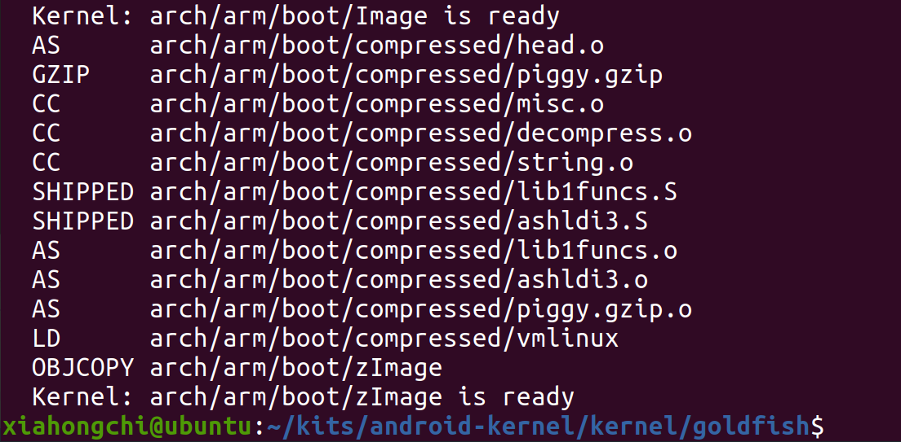
Because we need to recompile kernel once we modify the kernel files, there're numerous time that recompilation is needed, but it won't be shown again for concision.
##### 2.1.2 Page Tracing Testing
1. Designing the test file:
* In `page_trace_test.c`, to fully test the three system call to see whether page tracing of a specific task can be done, the test file not only repeat the test for different virtual address range, but also for different time intervals. What's more, the three implemented system calls are well tested in the test file.
* In `page_trace_test.c`, the mainly testing is first call `sys_start_trace()` to start tracing the current task, then perform totally 2048 memory writes to the task's memory space for totally 4 times in different memory range and different time intervals. After every test of 512 writes is done, `sys_get_trace()` is called to record the current `wcounts` and print it in the terminal. Finally, the system call `sys_stop_trace()` is called and allocated memory space is well freed. 
2. Running the test file `page_trace_test` in Android adb shell terminal, the result is as followed:
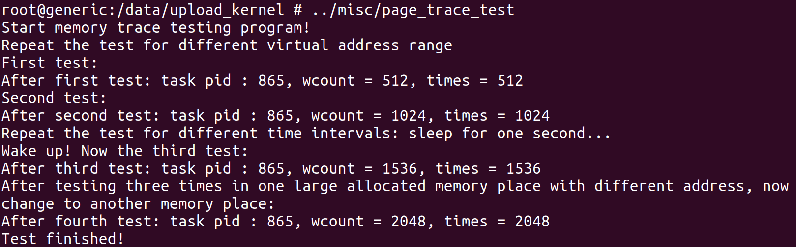
What's more, it can be seen from the kernel info that printed by the `printk()` function about the increase of `wcounts`:
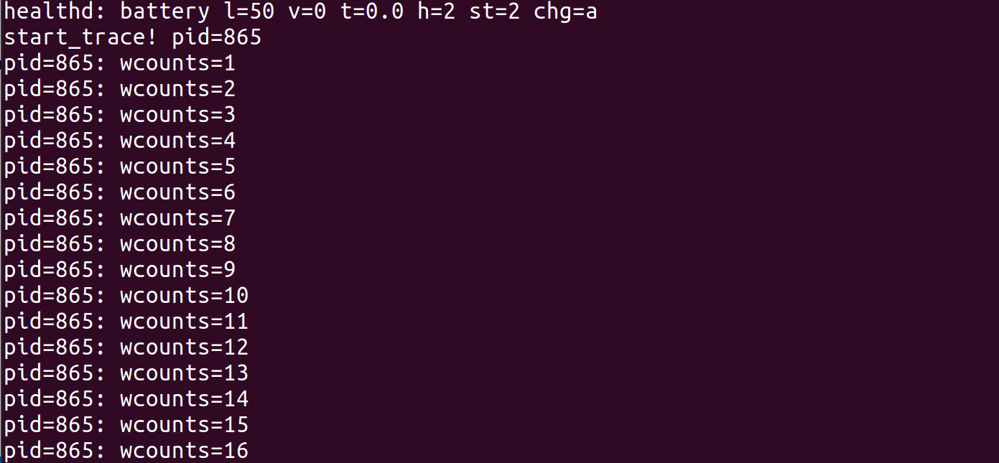</img>
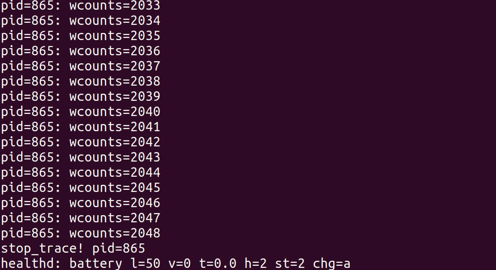</img>
So it can be seen that page tracing of writes to tasks is implemented successfully.
#### 2.2 Race-Averse Scheduling realization
##### 2.2.1 Overview of Implementation
* For every CPU, there is a run queue `rq` containing all ready tasks that are waiting for running. 
* For a run queue `rq`, it contains a run queue for every scheduling algorithm, so adding `ras_rq` and well implement it is needed.
* For scheduling, the concept of scheduling entity is used to represent every tasks, and every scheduling algorithm has its own scheduling entity. So implementing `struct ras_sched_entity` is needed.
* For every scheduling algorithm, there is a `sturct sched_class` that contains all needed functions that used to perform scheduling. So it's necessary to implement `ras_sched_class` to well perform RAS style scheduling.
* For RAS scheduling algorithm, it only has one run queue that is different from real time which has 99 run queues. 
* **For every task in RAS run queue, a variable named `weight` is in its scheduling entity, which is calculated by the tasks `wcounts` so as to distribute longer time slice for lower writes counts of tasks and perform a wrr style scheduling.**
##### 2.2.2 Implementation details
1. Numerous kernel files need to be modified:
* In `arch/arm/configs/goldfish_armv7_defconfig`, add a new line that lets `CONFIG_RAS_GROUP_SCHED=y`.
* In `init/Kconfig`, at about line 1459, adding configuration of `RAS_GROUP_SCHED` to the `CGROUP_SCHED` configuration, which is similar to `RT_GROUP_SCHED`.
* In `include/linux/init_task.h`, adding the initialization of the ras run queue `ras` to it, which is similar to what it's done to realtime run queue `rt`.
* In `include/linux/sched.h`:
  * define `SCHED_RAS` as the newly added scheduling algorithm.
  * declare the ras run queue `struct ras_rq`.
  * define the schedule entity of ras `struct sched_ras_entity`.
  * define some basic time slices value such as `RAS_FG_TIMESLICE`, `RAS_BG_TIMESLICE`, `RAS_INC_TIME` for ras and its wrr style scheduling.
  * add `struct sched_ras_entity ras` to `struct task_struct` as the tasks scheduling entity when using ras scheduling algorithm.
* In `kernel/sched/sched.h`:
  * declare the ras run queue `struct ras_rq`.
  * define `struct ras_rq` with single run list `struct list_head run_list`, `unsigned long ras_nr_running` to record the number of running tasks in queue and so on.
  * add the ras run queue `struct ras_rq` to `struct rq`, the run queue of CPU.
  * declare `extern const struct sched_class ras_sched_class`, which is the scheduling class of the newly implemented scheduling algorithm, containing several functions that are needed in scheduling tasks.
  * declare `init_ras_rq()` to initialize the ras run queue when booting.
* In `kernel/sched/core.c`:
  * In `__sched_fork()`, add a line `INIT_LIST_HEAD(&p->ras.run_list);` to initialize the `list_head` tasks link list that contains the ready tasks.
  * In `__setscheduler()` as well as `rt_mutex_setprio()`, modify the system call `sched_setscheduler` implementation to support set scheduling algorithm of tasks to RAS.
  * In `sys_sched_get_priority_max()` and `sys_sched_get_priority_min()` modify them to support the newly added RAS scheduling algorithm.
* In `kernel/sched/rt.c`:
  * In `const struct sched_class rt_sched_class` definition, change the item `.next` to `&ras_sched_class` instead of `&fair_sched_class` to let the priority of RAS scheduling algorithm ahead of fair scheduling algorithm.
2. Add a new kernel file `kernel/sched/ras.c` to implement RAS scheduling algorithm.
* `const struct sched_class ras_sched_class`: The RAS scheduling class definition which contains basic functions needed for RAS scheduling.
* `on_ras_rq()`: to check whether a sched_ras_entity `*ras_se` is on the current RAS run queue.
* `ras_rq_of_se()`: To get the RAS run queue of a specific sched_ras_entity when there has group scheduling.
* `init_ras_rq()`: Initialize RAS run queue like `ras_rq->run_list`, `ras_time`, `ras_nr_running` and the spin lock `ras_rq->ras_runtime_lock`.
* `calc_ras_weight()`: To calculate the weight of sched_ras_entity and the corresponding time slice that given to tasks according to the rule depicted in the chart following:

| wcounts   | weight | time slice |
| --------- | ------ | ---------- |
| 0-15      | 10     | 150ms      |
| 16-31     | 9      | 140ms      |
| 32-63     | 8      | 130ms      |
| 64-127    | 7      | 120ms      |
| 128-255   | 6      | 110ms      |
| 256-511   | 5      | 100ms      |
| 512-1023  | 4      | 90ms       |
| 1024-2047 | 3      | 80ms       |
| 2048-4095 | 2      | 70ms       |
| 4096-8191 | 1      | 60ms       |
| $\ge$8192 | 0      | 50ms       |

* `update_curr_ras()`: Update the running infomation such as `se.sum_exec_runtime` of the `task_struct` of the process running now. Its implementation is similar to what has been done in `rt.c`.
* `enqueue_task_ras()`: Enqueue a task to the RAS run list given by the kernel. It first calls `calc_ras_weight()` to get the weight and then calculates the corresponding time slice. Finally use `list_add()` or `list_add_tail()` to enqueue the task scheduling entity to the run list.
* `dequeue_task_ras()`: Dequeue a task from the run list when it's needed. Its implementation is similar to what has been done in `rt.c`.
* `pick_next_task_ras()`: Pick the next running task from the head of the run list. Its implementation is similar to what has been done in `rt.c`.
* `put_prev_task_ras()`: It put the current process back to the queue when its time slice expires. Its implementation is similar to what has been done in `rt.c`.
* `yield_task_ras()`: It also puts the current process back to the queue but when the process yield its CPU. The action is like what it has done in `put_prev_task_ras()`(just like a `requeue()` function).
* `check_preempt_curr_ras()`: It test whether to preempt the current running task when a sleeping task wakes up by calculating there weight and then compare them.
* `set_curr_task_ras()`: Setting the execution start time of current process.
* `watchdog()`: It's similar to what has been done in `rt.c`. 
* `task_tick_ras()`: When a tick passed, it's called and it will update the current running info, decrease the time slice and check whether the time slice is expired. If so, calculating the new time slice if the `wcounts` change during execution and then reschedule the task.
* `get_rr_interval_ras()`: For system call `sched_rr_get_interval()` implementation. Calculating the time slice of the current running process and then return it.

3. Also, it's necessary to modify `kernel/sched/Makefile` to add `ras.c` to compile procedure.

By the way, there're lots of `printk()` in the functions that modified or implemented to test whether the RAS scheduling algorithm works correctly.
##### 2.2.3 RAS Scheduling algorithm Testing
1. Create Test file named `ras_page_trace_test.c` and test all situations that needed.
* Firstly, allocate memory for one parent process and set the memory can only be read.
* Secondly, fork eight child processes and use system call `sched_setscheduler()` to change their scheduling algorithm to RAS.
* Thirdly, each child process calls `sys_start_trace()` and then access the protected memory space for numerous times.
* Fourthly, call `sys_stop_trace()` and `sys_get_trace()` to have a regression test and free the memory space when exiting the program.
2. Boot the emulator and redirect the output of kernel info to a `.txt` file due to the length of the kernel info is too long to be contained in the terminal:
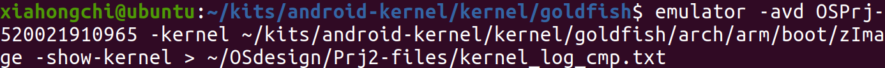
3. Insert the needed module and run the test program `ras_pt_test`, the output in the terminal looks like:
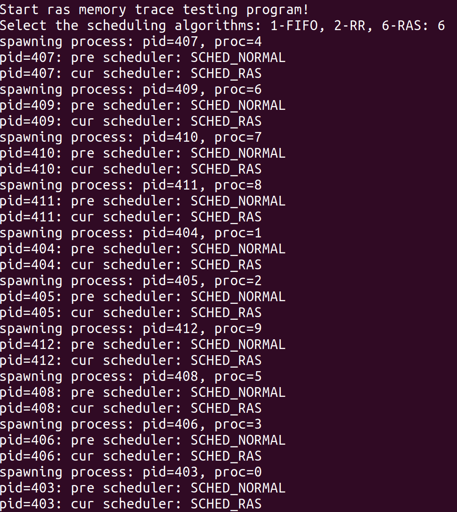</img>
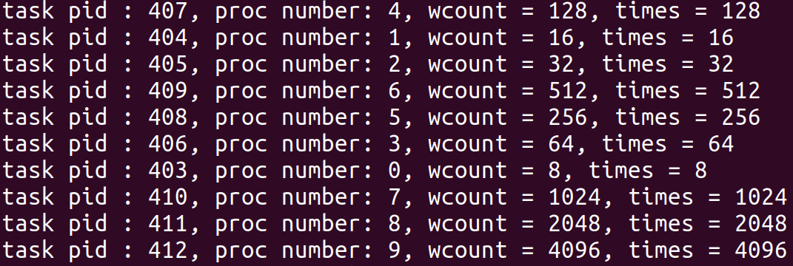</img>
So the scheduling algorithm is correctly changed to RAS and the regression test of page trace successfully.
1. Open the file called `kernel_log_cmp.txt`(A file which has `77634 lines`) which contains the kernel printed infomation. At about `line 17065`, the RAS scheduling algorithm starts working, and it can be seen that related functions are called correctly:
* The start of program:
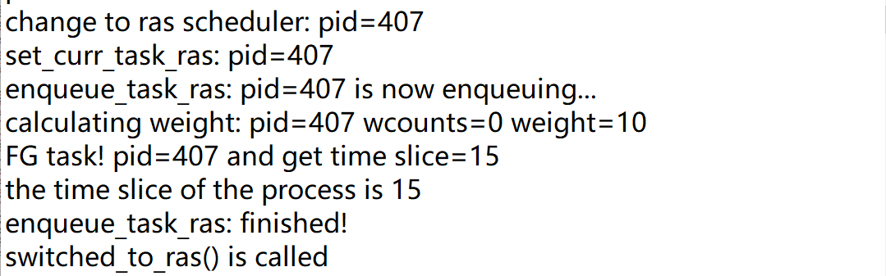
  * The first line is printed by `__setscheduler()`, to prove that process change to RAS successfully.
  * The fourth line is printed by `calc_ras_weight()` when calculating the weight of the current process.
  * The fifth line is printed by `enqueue_task_ras()` showing the time slice calculated.
  * Other infomation shows the functions called by the RAS scheduler.
* When the `wcounts` changes, the `weight` calculated changes as well as the corresponding time slice:
  * **At the beginning:** `wcounts=0` and `weight=10`, `time slice=150ms`
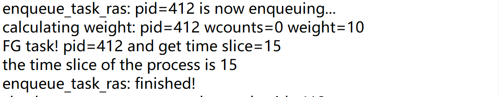
  * **In the middle:** `wcounts=22` and `weight=9`, `time slice=140ms`

  * **Later in the running time:** `wcounts=1460` and `weight=3`, `time slice=80ms`
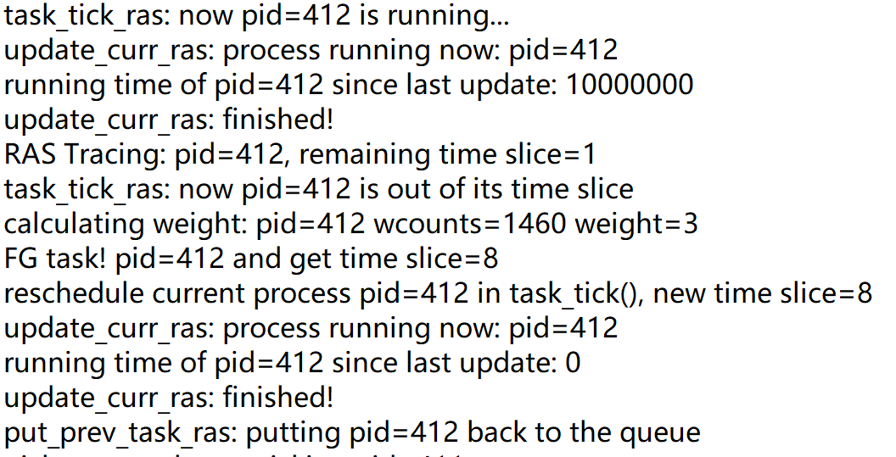

  It can be seen that the time slice of `pid=412` is decreased according to the `wcounts` during running time.
* At the waking up time of a process, there can be a preemption happened:
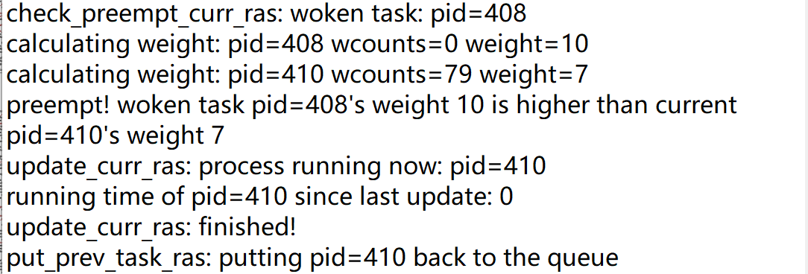
In the picture above, the `weight` of `pid=410`(current running process) is larger than the waking up process `pid=408`. So in the `check_preempt_curr_ras()`, the current process is preempted and finally put back to the run queue by `put_prev_task_ras()`.
* During every timer interrupt, `task_tick_ras()` is called, and time slice decreases:
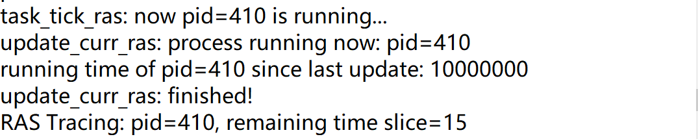
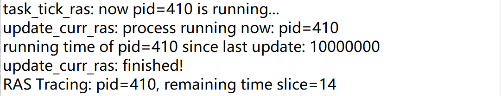

There're even more infomation can be founded on the kernel log, and it proves that RAS scheduling algorithm works correctly.
### 3. Project Two : Extended ideas
#### 3.1 Different scheduling algorithms for background tasks
##### 3.1.1 Special time slice setting for background tasks: 
Because background tasks need to be better scheduled and are often received shorter time slice, `#define RAS_BG_TIMESLICE		(30 * HZ / 1000)` is added to file `include/linux/sched.h` and also use wrr style and calculating `weight` and time slice like foreground tasks:

| wcounts   | weight | time slice |
| --------- | ------ | ---------- |
| 0-15      | 10     | 130ms      |
| 16-31     | 9      | 120ms      |
| 32-63     | 8      | 110ms      |
| 64-127    | 7      | 100ms      |
| 128-255   | 6      | 90ms       |
| 256-511   | 5      | 80ms       |
| 512-1023  | 4      | 70ms       |
| 1024-2047 | 3      | 60ms       |
| 2048-4095 | 2      | 50ms       |
| 4096-8191 | 1      | 40ms       |
| $\ge$8192 | 0      | 30ms       |
##### 3.1.2 Detect a process foreground or background:
* Modify `kernel/sched/debug.c`: remove the `static` tag of function `task_group_path()`.
* In `kernel/sched/ras.c`: judging a process to see whether it's foreground or background and then distribute time slice to it by calling `gp = task_group_path(task_group(p));` and then `strcmp(gp,"/") == 0` or `strcmp(gp,"/bg_non_interactive") == 0`. If the former matches, then it's a foreground task. Else it's a background task.
##### 3.1.3 One more system call implemented
To better test the implementation, one more system call named `sys_set_wcounts()` is implemented only for testing the background process to see whether the time slice is changed according to the `wcounts` or not.
##### 3.1.4 Testing the implementation
1. A `.apk` test program called `processtest`. (Here to thank the TA Hang Zeng providing the test program).
When the home button on avd is clicked, the program turns into a background process. Unless it's a foreground process.
2. A monitor as well as a test program file called `ras_trace_bg` which can change the scheduler, get the time slice and change the `wcounts` for test of a specific process.
3. Running the two program and testing:
  **foreground state:**
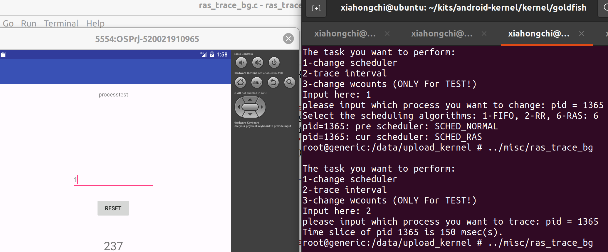
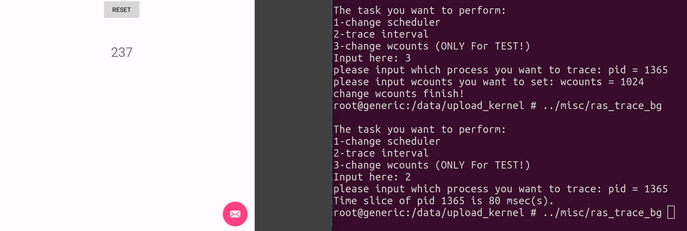
  **background state:**
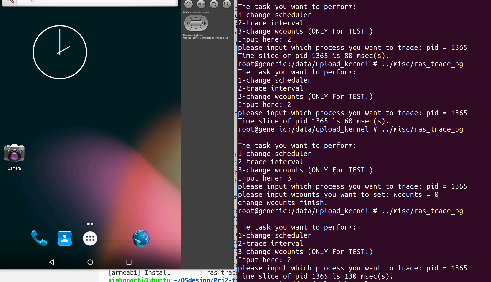
  **kernel log info:**
  pay attention to `"BG TASK!"` and different time slice allocated.
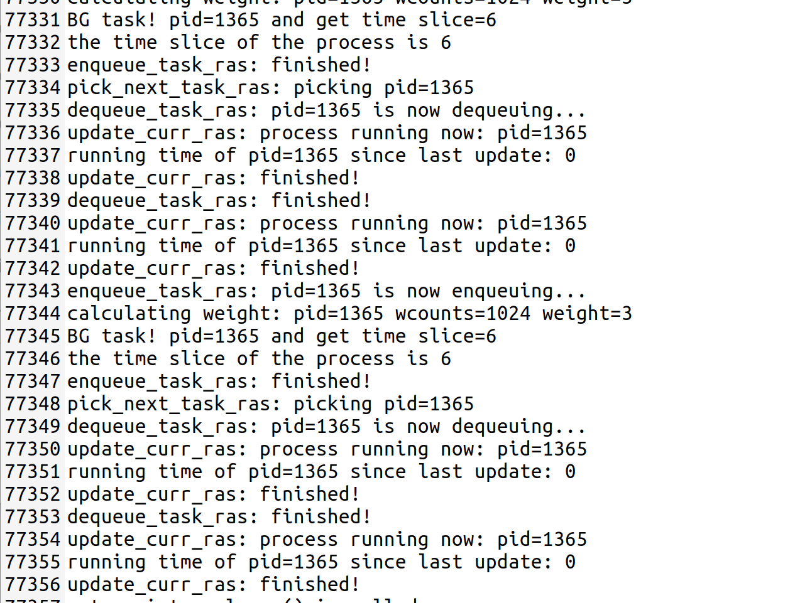

So it can be seen that background tasks are treated differently and its implementation is successful.
#### 3.2 Measuring and Comparison between different scheduling algorithms
##### 3.2.1 Measure the running time of specific process
* In `include/linux/sched.h`, adding one more variable to `task_struct` named `rr_fifo_trace`. When the process is using RR or FIFO scheduling algorithm and `rr_fifo_trace=1`, the process will be traced by the kernel.
* In `kernel/sched/rt.c`, modify the function `task_tick_rt()`. When a tick passed, call `printk()` to kernel log if `rr_fifo_trace=1` in order to trace its running state.
* Add one more system call `sys_rr_fifo_trace()`, to set the `pid` process's `rr_fifo_trace=1` to start tracing.
##### 3.2.2 Get the running time data
* Running the same test program but change into different scheduling algorithm like RR or FIFO, as the following picture shows:
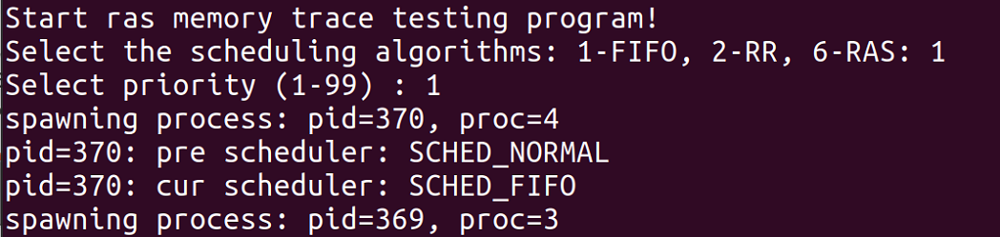
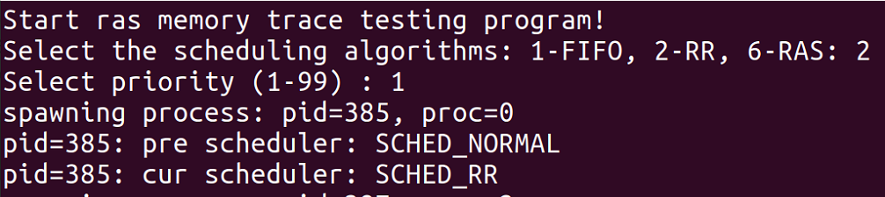
Nine more process scheduler change info is omitted.
* Get the `printk()` infomation in the kernel log (RAS measuring has been implemented in the previous contents). It's like `FIFO tracing:...` and `RR Tracing: ...` and `RAS Tracing: ...` with pid in the `printk()` strings.
* Write a program named `cmp.c` to pre-process the kernel log infomation into tables which has two column `time` and `pid` and rows represent different time.
* Use **matlab** program `pic.m` to draw the gantt graph of FIFO, RR and RAS, as it's shown below:
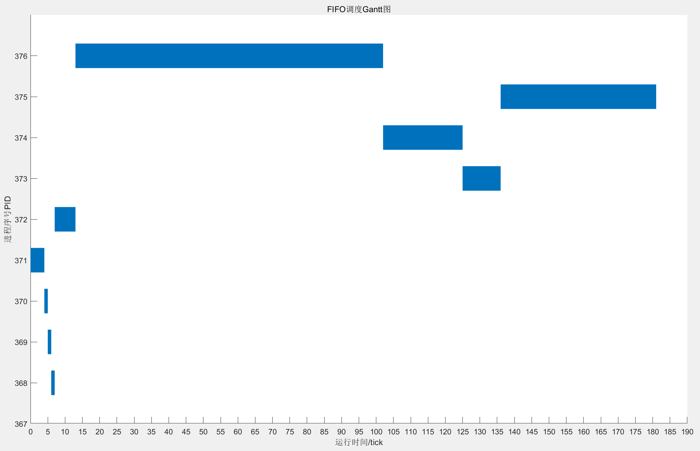
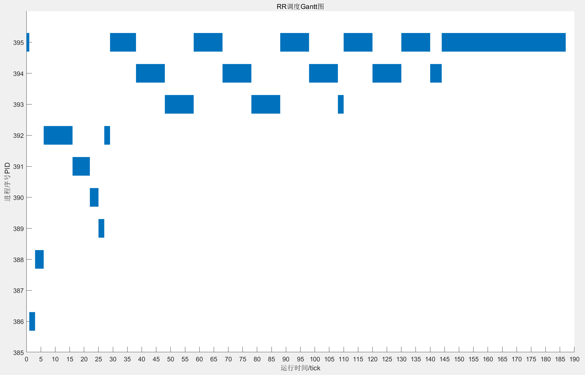
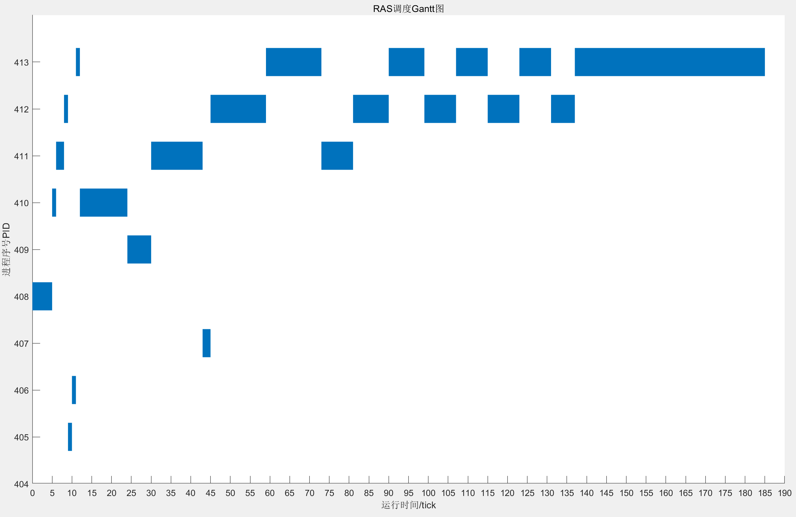
As the graphs show, FIFO encounters **convoy effect** when executing process `pid=376`, RR shows the classic round robin style in gantt and RAS **dynamically change its time slice** when executing.
* Calculating the avarage turnaround time and avarage waiting time of FIFO, RR and RAS (Also done by `cmp.c`):
* **FIFO:**
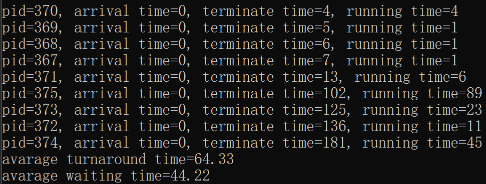
* **RR:**
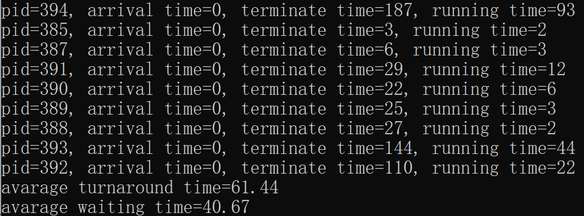
* **RAS:**
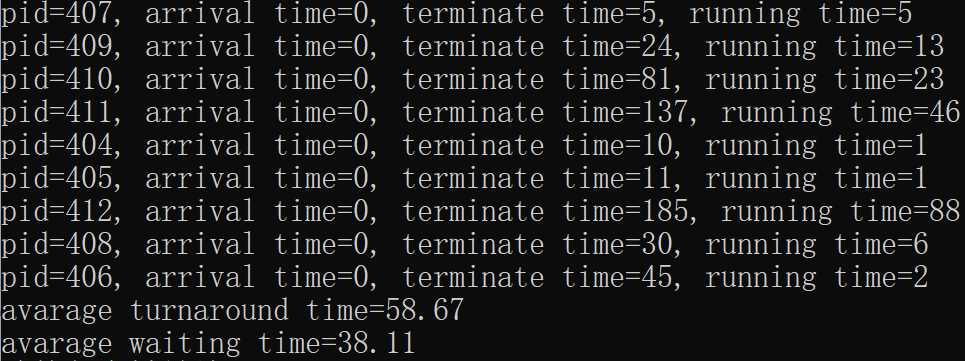

| Scheduling algorithm | avarage turnaround time/ticks | avarage waiting time/ticks |
| -------------------- | ----------------------------- | -------------------------- |
| FIFO                 | 64.33                         | 44.22                      |
| RR                   | 61.44                         | 40.67                      |
| RAS                  | 58.67                         | 38.11                      |
Although it's just one test, which is limited to the number of samples, but it can be clearly seen that **when it comes to the comparison of avarage turnaround time and avarage waiting time, RAS has a higher efficiency than RR than FIFO**.
So RAS scheduling algorithm has its advantages over other scheduling algorithms like RR and FIFO.
### 4. Project Two : Thoughts
#### 4.1 Obstacles
1. In page tracing realization, I encountered obstacles when I found that when I try to implement it according to the original advised realization provided by the Prof.Wu and TAs, **the page fault handler will repeat the same write instruction again and again because it can't handle the write request anyway.** So I add TA Hang Zeng's wechat, telling him the obstacles that I encountered, and they change the advised realization plan of the project by adding a signal `SIGSEGV` handler and calling `mprotect()` to remove the `PROT_WRITE` bit before write request while adding the `PROT_WRITE` bit in the signal `SIGSEGV` handler. **By the Professors and TAs efforts as well as my suggestions, the problem is solved in Sunday before the introduction of the project 2 in tomorrow Monday.**
2. In the realization of RAS scheduler, I firstly have no idea what to do. So I read numerous blogs and related kernel source codes and grasp the essential idea of implementing a new scheduling algorithm in kernel.
3. In the foreground and background process testing, I encountered the obstacles that I can't create a background process using `nohup &` like what I used to do in Ubuntu Linux. Trying to solve it by self but failed. So I asked TA Hang Zeng for help. Through him I learned about the different process management that Android owned, which is different from what is done in Linux. By the way, he gave me a test program `.apk` so I can test my implementation of background scheduling algorithm.
#### 4.2 Gains
1. As the gains in knowledge: I get familiar with page fault handling process in linux as well as scheduler implementation in linux.
2. As the gains in my mentality, experiencing the failures and obstacles during the project, I get quite patient and positive after. I will use the patience the same as when I read thousands of lines of linux source code and the positiveness when I encountered faliures in the future life.
### 5. Project Two : Acknowledgement
* Thanks for all Professors and TAs to help me finish the struggling project.
### 6. Project Two : Reference
* https://github.com/binwang0105/Linux_kernel_dev_scheduler
* https://github.com/perceptionpoint/suprotect
* https://mp.weixin.qq.com/s/G3kFbquZXlp3Jhul99zf8A
* https://man7.org/linux/man-pages/man2/sched_setscheduler.2.html
* https://blog.csdn.net/vic_qxz/article/details/120888410
* https://www.cnblogs.com/LoyenWang/p/12116570.html
